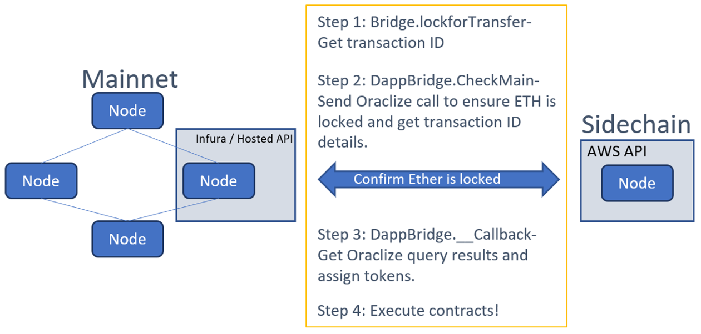

# Oracle bridge


## General

The Oracle bridge is a simple implementation for linking two EVM chains using 'Oraclize', a data transport layer for connecting API's to our contracts.  

The code allows for parties to lock Ether (and eventually tokens) on another EVM chain by bridging the chains.  The chains can read the activity on the other chain through API's of two hosted nodes (Infura style).  This bridge is a very simple option for parties with two EVM chains looking to utilize mainchain assets (e.g. Ether) on their own private or public chain.  Rather than rely on a POA chain or centralized party to relay information to the chains, the network is secured by relying on a hosted node which allows access of the JSON-RPC API of the chain.  With the advent of trusted hardware solutions (such as Intel's SGX), nodes can be hosted in a secure manner, and the two chains can still take advantage of a purely public chain while additional, completely decentralized solutions are developed.  


## Contracts

* Bridge.sol - mainnet bridge contract linked to the sidechain via API and DappBridge.sol contract address.
* DappBridge.sol - Sidechain bridge contract linked to the mainnet via API and Bridge.sol contract address.
* Wrapped_Token - contains the ERC20 functions needed to wrap ETH into an ERC20 token.  
* String.sol - is a library called by both bridge contracts to help convert different output or input to strings. 

Both bridge contracts use Oraclize.

### The Bridge Contracts

Only two contracts are necessary for the bridge contract to be active on a chain: the Oraclize contract and the Bridge Contract or the DappBridge Contract.  Oraclize contracts are deployed already on mainnet and the main testnets on Ethereum and the Ethereum Bridge library makes the deployment very simple on your own chain.  

The bridge contracts are two fold: a token contract and a bridge contract.  

The basic flow of sending Ether to the other chain (mainchain to dappchain):

    On mainchain:
        *Party deposits and locks Ether into Bridge contract
            *This creates a 'transferId' which is mapped to the amount and the owner
    On the dappchain:
        *Party uses the 'transferId' to query (via Oraclize) the mainchain for the amount locked and the owner
        *If the returned owner is that party, they are issued tokens that represent that amount and the transferId is marked as complete

    To withdraw from the dappchain, the functionality is identical only the role of Ether and the dappchain tokens are reversed.


## Setup

  Download Ethereum Bridge:  https://github.com/oraclize/ethereum-bridge 

	Start the 'mainchain'
	Open Ethereum Bridge on mainchain
	Create Bridge contract with OARAddress 


	Start the dapp chain
	Open Ethereum Bridge on dapp chain
	Create DappBridge contract with OARAddress

    Enter deployed bridge contract address on opposite chain
    Enter API information on other chain (e.g. https://localhost:8545.result or https://mainnet.infura.io.result)

## Structure

### Variables

      string public bridgedChain;
      uint public total_deposited_supply;
      uint public total_locked;
      uint transNonce;
      address public partnerBridge; //address of bridge contract on other chain
      string api;
      string parameters;
      address public owner;
      bytes4 method_data;

      struct Details{
        uint amount;
        address owner;
        uint transferId;
      }

      mapping(address => uint) deposited_balances;
      mapping(uint => Details) transferDetails; //maps a transferId to an amount
      mapping(address => uint[]) transferList; //list of all transfers from an address;
      mapping(uint => bool) pulledTransaction;


### Functions

#### Basic Functions Flow to Transfer from Mainnet to Sidechain



#### Bridge Contract
    
    constructor()

    setOwner (address _owner) public onlyOwner()

    lockforTransfer() payable public returns(uint) 
  
    checkChild(string _transferId) public payable

        getTransfer(uint _transferId) public returns(uint,address,uint)

        createQuery_value(string _id) public constant returns(string)

    __callback(bytes32 myid, string result) public 

    withdraw(uint _value) public

    depositedBalanceOf(address _owner) public constant returns (uint)

    setPartnerBridge(address _connected) public onlyOwner()

    setAPI(string _api, string _params) public onlyOwner()

#### DappBridge Contract

The DappBridge contract excludes the withdraw function,the checkChild (although it has the same functionallity as the Bridge contract) was renamed to checkMain for clarity and the checkMain is not payable and requires an amount to lock. 

    constructor()

    setOwner (address _owner) public onlyOwner()

    lockforTransfer(uint _amount) public returns(uint)
  
    checkChild(string _transferId) public payable

        getTransfer(uint _transferId) public returns(uint,address,uint)

        createQuery_value(string _id) public constant returns(string)

    __callback(bytes32 myid, string result) public 

    depositedBalanceOf(address _owner) public constant returns (uint)

    setPartnerBridge(address _connected) public onlyOwner()

    setAPI(string _api, string _params) public onlyOwner()


### Centralization and other concerns

#### Centralization:

Rather than be reliant on a POA network or trusted relayers to do the work, the trust in this mechanism is placed on the party hosting the API and the Oraclize service.  It's a different form of trust than relying on a centralized party to validate all transactions and with the use of trusted hardware and other incentive mechanisms for the hosts, this solution provides a method that is easy to deploy, easy to understand, and very close to the true goal of complete trustlessness.  

#### Node Survivability and Corruption Assumptions:

The owner in these contracts can change the location of the API.  Ideally, the changing of this value could be performed by a voting mechanism of stake holders.  

#### Chain Survivability Assumptions:

What happens if the other chain dies or is attacked?


#### Missed Oraclize calls:

Solved by having transferId's, you can query as many times as you want.


#### Notes:

All contracts are created by the Decentralized Derivatives Association

**Disclaimer-** Contracts are currently in development and should not be used for real value

## Testing
Once set up using truffle and localhosts, run from each chain:

```
truffle test
```

Should you make any changes to the contract files, make sure you `rm -rf build` before running `truffle compile && truffle test`.